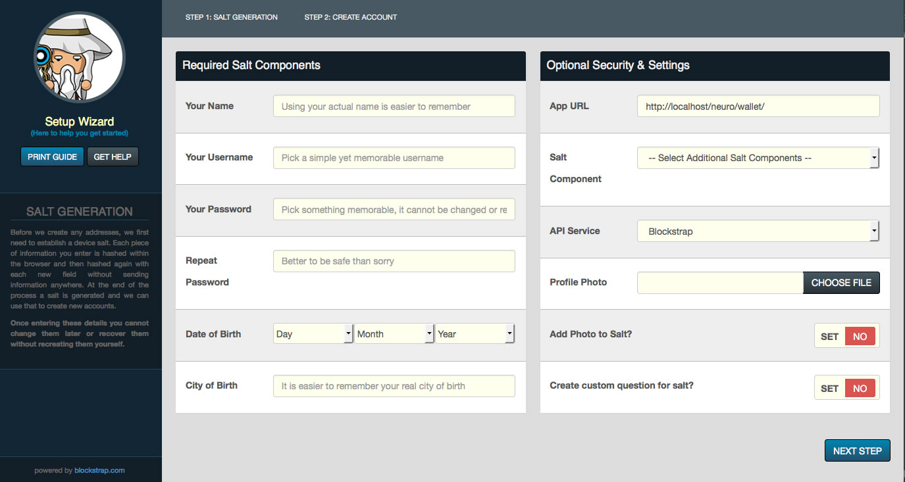
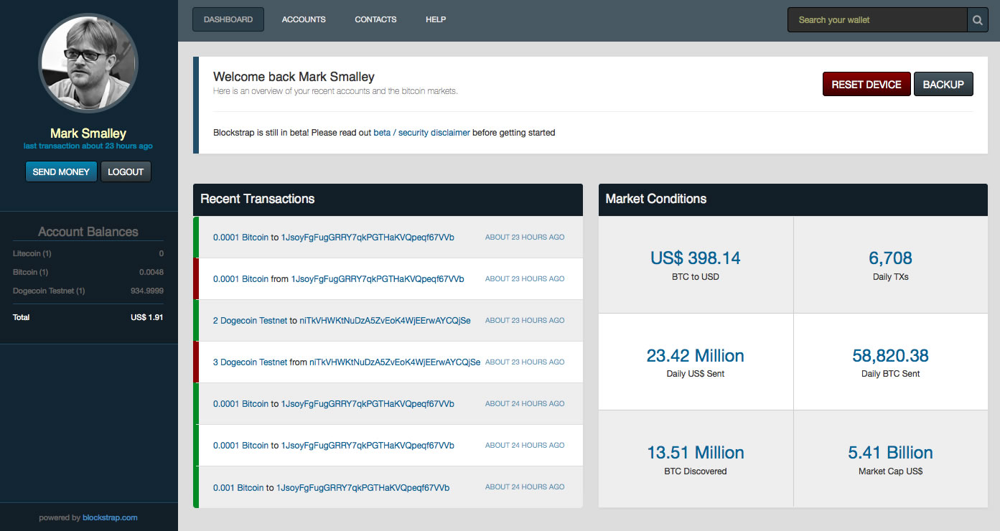

# WARNING
----------

`PLEAE NOTE THIS IS NOT A STABLE RELEASE AND SHOULD ONLY BE USED BY THOSE THAT UNDERSTAND HOW IT WORKS`

---------------------------------------------------------

## Blockstrap - The OpenSource HTML5 Blockchain Framework

The Blockstrap framework provides a front-end HTML5 interface for web-applications to communicate and manipulate blockchains using either external web-accessible APIs or self-hosted local QTs direct from the source.

By default, it is configured to use the [BlockCypher API](http://blocksypher.com) but as well as being a blockchain-agnoistic framework, Blockstrap is also API-neutral throughout. This allows you to host and manage your own API end-points or select from others configured at core, with examples included and ready for use with the following services:

* [BlockCypher](http://blockcypher.com) (Supporting 3 Chains)
* [Toshi](http://toshi.io) (Supporting 2 Chains)
* [BlockTrail](http://blocktrail.com) (Supporting 2 Chains - __read only - no TX relay__)
* __LocalQTs__ (only supported by QTs featuring watch-only addresses - __currently requires manual import of addresses__)

We will also be adding support for the following APIs before officially re-launching:

* [SoChain](http://chain.so) (Can Support 6 Chains? - not yet tested since work continued)
* [BlockR](http://blockr.io) (Can Support 5 Chains? - not yet tested since work continued)
* [Blockchain.info](http://blockchain.info) (requires PHP proxy - work underway)
* [Insight](http://insight.is) (Can Support 2 Chains? - work underway)

The framework itself is currently capable of supporting the following blockchains:

* __Bitcoin__
* __Dash__
* __Dogecoin__
* __Litecoin__
* Bitcoin Testnet
* Litecoin Testnet
* Dash Testnet
* Dogecoin Testnet

The framework has been developed with modularity and flexibility as the focal point of each technical decision. 

This has enabled us to provide support for plugins and themes and allows developers to easily extend, modify and truly customize every aspect of the application. Included within the framework download as examples are the following themes:

* Default Wallet (as seen below)
* Priorities (community-driven crowd-sourced to-do list)
* BrainControl 2.0 (example of a modified wallet with simplified setup process)

We've also bundled the following plugins:

* Market Conditions
* Inline Shapeshift.io Coin Exchange
* API Tests

Everything is powered by one or more of the following interchangable [modules](docs/en/framework/modules/):

* [Accounts](docs/en/framework/modules/accounts/)
* [API](docs/en/framework/modules/api/)
* [Blockchains](docs/en/framework/modules/blockchains/)
* [Buttons](docs/en/framework/modules/buttons/)
* [Contacts](docs/en/framework/modules/contacts/)
* [Data](docs/en/framework/modules/data/)
* [Filters](docs/en/framework/modules/filters/)
* [Forms](docs/en/framework/modules/forms/)
* [HTML](docs/en/framework/modules/html/)
* [Multisig](docs/en/framework/modules/multisig/)
* [Security](docs/en/framework/modules/security/)
* [Styles](docs/en/framework/modules/styles/)
* [Templates](docs/en/framework/modules/templates/)
* [Widgets](docs/en/framework/modules/widgets/)

When combined, they form our default deterministic wallet, which can be setup in seconds:

Once setup, users are provided with a fully-featured responsive experience that is available on any device - with support for accounts, contacts, message signing and much more. Come take a look at the live demo - [http://blockstrap.com/demo/](#)

__No private keys are ever stored or transmitted as they are only generated inline at the moment of transaction. Public information is stored within the device using HTML5 localStorage so is unavailable when browsing privately.__

We suggest that you read our [documentation](docs/en/) for more information and instructions on how to get started.

-----

#### PLEASE NOTE THAT OUR DOCUMENTATION IS UNDERGOING REJUVINATION

Specific topics of interest include:

* [Blockstrap Applications](docs/en/applications)
* [Blockstrap Framework](docs/en/framework)
* [Blockstrap Plugins](docs/en/plugins)
* [Supported Blockchains](docs/en/blockchains)
* __Embeddable Widgets__ (more documentation coming soon)